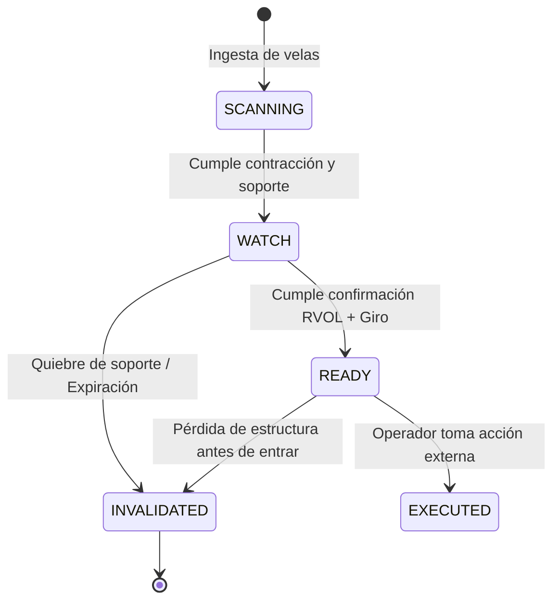

# PRD-002: Playbooks y Estrategias Operativas

**Documento:** Trading Playbooks & Algorithmic Setups  
**Código:** PRD-002  
**Versión:** 1.0.0  
**Estado:** Formalizado  
**Módulos Asociados:** RF-01 (Spot Radar), RF-02 (Futures), RF-03 (Memes)  
**Última Actualización:** 2026-09-23  

---

## 1. Introducción y Propósito

Este documento describe la mecánica cuantitativa y discrecional de los patrones de trading evaluados por el motor de análisis. Define formalmente qué constituye un setup válido, sus condiciones de entrada, objetivos, criterios de invalidación y el ciclo de vida de cada señal.

---

## 2. Playbook Principal: Spot Dip & Bounce (Táctico)

Este es el patrón central implementado en la Fase 1 (MVP). Modela el comportamiento típico de activos líquidos que sufren ventas forzadas o tomas de ganancia transitorias (ej. setups históricos observados en **ZEC**, **ALLO**, etc.).

```text
       ESTRUCTURA VISUAL DEL PLAYBOOK (VELAS 1h / 4h)
       ───────────────────────────────────────────────
Precio
  ▲
  │     [Impulso previo / Estructura alcista mayor]
  │        ▲
  │       / \      (Fase 1: Caída o Corrección Fuerte)
  │      /   \
  │           \    -4% a -12% en ventana móvil (ej. 24h-48h)
  │            ▼
  │            ─────── [Fase 2: Soporte / Rechazo de Mínimos]
  │            │     ▲ (Mecha inferior / Exhaustion)
  │            │    /
  │            └───/── [Fase 3: RVOL > 1.2 + Recuperación Temprana]
  │               └───> [ALERTA DISPATCH: Estado READY / WATCH]
  │                     Objetivo: +3% a +10% ──┐
  │                     Stop / Inval: < Mínimo ─┴───────────────► Tiempo
```

### 2.1 Condiciones Secuenciales del Setup

1. **Fase 1: Contracción Pronunciada con Liquidez:**
   - La serie temporal (1h/4h) registra una caída relativa acumulada significativa (entre $-4\%$ y $-15\%$) dentro de una ventana de lookback predeterminada ($N=24$ a $48$ periodos).
   - El activo no debe estar muerto: el volumen diario en el par USDT debe superar el umbral mínimo de liquidez (Top 50 pares en volumen).

2. **Fase 2: Testeo y Rechazo de Soporte (Exhaustion):**
   - El precio alcanza un nivel de soporte clave (mínimo de rango previo o media móvil de control).
   - Se evidencia rechazo de precios inferiores mediante mechas de absorción o desaceleración en el tamaño del cuerpo de las velas bajistas.

3. **Fase 3: Giro de Impulso y Confirmación de Volumen:**
   - **Volumen Relativo (RVOL):** El volumen en la vela de giro o estabilización supera su promedio móvil ($RVOL \ge 1.2$).
   - **Momentum:** Giro positivo del RSI (saliendo de zona de sobreventa $< 35$ hacia neutralidad) o formación de un mínimo creciente (*higher low*) en 1h.
   - **Distancia al Objetivo vs. Riesgo:** Relación Beneficio/Riesgo calculada teórica $\ge 2.0$.

### 2.2 Parámetros Numéricos del Setup Spot

| Variable | Parámetro por Defecto | Justificación |
| :--- | :--- | :--- |
| **Timeframe Principal** | `1h` (confirmado con `4h`) | Suficiente agilidad táctica sin el ruido de 5m/15m. |
| **Objetivo de Retorno** | $+3.0\%$ a $+10.0\%$ | Movimiento realista de rebote a resistencia local. |
| **Nivel de Invalidación** | Cierre de vela $1h < \text{Mínimo de la mecha}$ | Quiebre estructural que invalida la hipótesis de absorción. |
| **Umbral RVOL** | $\ge 1.25$ | Garantiza interés institucional temprano en el rebote. |

---

## 3. Playbook Secundario: Liquidity Sweep & Reclaim (Futures Radar)

*Planificado para Fase 2.* 

Monitorea la acumulación de liquidez en los extremos del mercado de derivados y la absorción de órdenes de liquidación.

```text
1. Identificación de Cluster ──> 2. Barrida Agresiva ──> 3. Reclaim Inmediato ──> 4. Alerta Condicional
(Pool de stop orders)           (Wick fuera del rango)   (Cierre dentro de rango)  (Long/Short con R:R óptimo)
```

- **Premisa:** Una zona de liquidaciones no es un imán pasivo. Si el precio la atraviesa con aceleración y cierra dentro del rango, se interpreta como trampa de liquidez (*false breakout*).
- **Salida esperada:** Determinación de estado condicional para evitar anticiparse sin confirmación:
  > `BTCUSDT — LIQUIDITY RADAR`  
  > `Zona: 78,200 USDT | Estado: APROXIMACIÓN (Sin absorción confirmada) -> WAIT`

---

## 4. Playbook de Protección: Meme Early Mover Filter

*Planificado para Fase 2.*

Su objetivo no es pronosticar qué meme token se multiplicará por 100, sino **detectar volumen naciente y eliminar el 95% de estafas**:

- **Filtros Mandatorios de Exclusión:**
  - Concentración en top 10 wallets $> 25\%$ (excluyendo contratos de pools).
  - Liquidez de pool sin bloquear o sin quema verificada $\rightarrow$ **Descarte automático**.
  - Código con capacidad de modificar comisión de venta (*honeypot*) o emitir tokens sin tope $\rightarrow$ **Descarte automático**.
- **Disparador:** Incremento repentino de transacciones únicas ($+300\%$ en 30 min) con liquidez mínima en pool $> \$100,000$ USD.

---

## 5. Ciclo de Vida Formal de los Estados de Alerta

Todas las estrategias deben adherirse estrictamente a la máquina de estados:



- **`WATCH` (Monitoreo):** El activo cumplió con la caída previa y el testeo de soporte, pero aún no tiene volumen o confirmación de giro. El operador debe mantenerlo en la mira.
- **`READY` (Accionable):** Se confirmaron todas las variables del playbook (soporte + RVOL + ratio R:R). Parámetros de entrada, objetivo e invalidación completamente definidos.
- **`INVALIDATED` (Cancelado):** El precio perforó el nivel de invalidación o transcurrieron $N$ periodos sin que el rebote se materialice.
