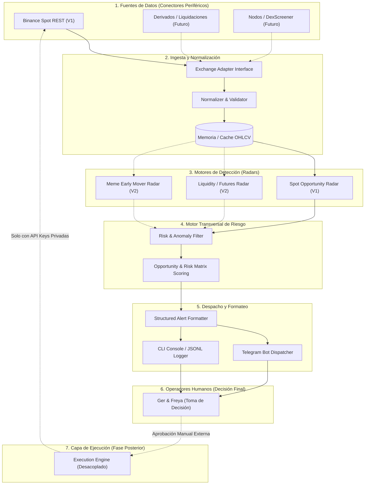

# SAD-001: Arquitectura del Sistema (System Architecture Document)

**Documento:** System Architecture Document (SAD)  
**Código:** SAD-001  
**Versión:** 1.0.0  
**Estado:** Aprobado  
**Tipo de Arquitectura:** Pipeline Modular Desacoplado (Pipes & Filters)  
**Última Actualización:** 2026-09-23  

---

## 1. Visión General y Filosofía de Arquitectura

El sistema **Crypto Multi-Tool (Radar & Copilot)** está diseñado bajo una arquitectura de **Pipeline Modular Desacoplado**. Su objetivo es garantizar que la lógica de negocio y las estrategias analíticas sean completamente independientes de los proveedores de datos (CEX/DEX) y de los canales de salida (Telegram, CLI, Dashboards).

### 1.1 Principios Arquitectónicos
1. **Inversión de Dependencias (DIP):** El motor analítico no conoce a la API de Binance ni a la API de Telegram; consume contratos normalizados de mercado y emite señales neutrales.
2. **Composición de Filtros (Pipes & Filters):** El flujo de datos atraviesa etapas lineales e independientes (Ingesta $\rightarrow$ Normalización $\rightarrow$ Análisis $\rightarrow$ Filtro de Riesgo $\rightarrow$ Despacho).
3. **Aislamiento Total de la Capa de Ejecución:** El módulo de ejecución de órdenes (*Execution Engine*) no forma parte del pipeline de análisis y requiere confirmación física explícita para ser invocado.

---

## 2. Diagrama de Arquitectura Global (C4 - Containers)



---

## 3. Descripción de Capas y Componentes

### 3.1 Capa 1: Conectores de Datos (Data Ingestion)
- **Responsabilidad:** Conectarse a las fuentes públicas de mercado, gestionar los límites de peticiones (*rate limiting* / ponderación de pesos), manejar reconexiones y serializar respuestas brutas.
- **Modo en Fase 1:** Adaptador `BinancePublicClient` en modo estricto de solo lectura. No almacena ni requiere credenciales secretas.

### 3.2 Capa 2: Normalización y Buffer de Mercado (Normalizer)
- **Responsabilidad:** Convertir los arrays crudos de velas en objetos fuertemente tipados [`MarketCandle`](file:///E:/projects/gsolut/mvp-crypto-multi-tool/docs/02_architecture/SAD-002_data_contracts_and_schemas.md) con timestamps normalizados UTC y tipos numéricos de punto flotante o decimal de alta precisión.

### 3.3 Capa 3: Motores de Análisis (Radars)
- **Responsabilidad:** Implementar algoritmos de inspección técnica sobre las series temporales normalizadas.
- **Modularidad:** Cada radar es una clase o función desacoplada que implementa la interfaz `RadarEngine`:
  ```python
  class RadarEngine(Protocol):
      def evaluate(self, series: MarketSeries) -> list[SignalCandidate]: ...
  ```

### 3.4 Capa 4: Filtro Central de Riesgo y Scoring
- **Responsabilidad:** Actuar como filtro aduanero común para todas las señales emitidas por cualquier radar.
- **Lógica:**
  - Aplica filtros de corte duro (volumen mínimo, spread, anomalías de datos).
  - Asigna la clasificación binaria o matricial: **Oportunidad** (`ALTA` / `MEDIA` / `BAJA`) vs. **Riesgo** (`ALTO` / `MEDIO` / `BAJO`).
  - Asigna el estado formal del ciclo de vida (`WATCH` o `READY`).

### 3.5 Capa 5: Despacho y Notificaciones (Dispatch)
- **Responsabilidad:** Transformar el objeto estructurado [`AlertPayload`](file:///E:/projects/gsolut/mvp-crypto-multi-tool/docs/02_architecture/SAD-002_data_contracts_and_schemas.md) en mensajes legibles y concisos para humanos.
- **Canales:**
  - **Consola / CLI:** Para depuración local y ejecución interactiva.
  - **Telegram Bot / Webhook:** Envío inmediato a los chats privados de los operadores.
  - **JSONL Event Log:** Persistencia en disco para auditoría y backtesting posterior.

---

## 4. Aislamiento Físico del Motor de Ejecución

Una decisión fundamental de diseño es que el **Execution Engine no existe dentro del paquete ni del runtime del Radar de Fase 1**.

```text
┌──────────────────────────────────────┐        ┌──────────────────────────────────────┐
│       RADAR & COPILOT RUNTIME        │        │       EXECUTION ENGINE RUNTIME       │
│  - APIs públicas de solo lectura     │        │  - Requiere API Key y Secret privado │
│  - Zero riesgo de drenaje de fondos  │        │  - Validación de firma HMAC          │
│  - Emite notificaciones informativas │        │  - Ejecución solo con token manual   │
└──────────────────────────────────────┘        └──────────────────────────────────────┘
                  │                                                ▲
                  │             (Canal de Notificación)            │
                  └────────────► [Operador Humano] ────────────────┘
                                 (Decide y Autoriza)
```

Esta separación física garantiza que una vulnerabilidad, bug o mal comportamiento del radar **jamás pueda colocar órdenes financieras accidentales**.

---

## 5. Requerimientos No Funcionales (NFR)

1. **Rendimiento:** Escaneo y evaluación de 50 pares en $< 15$ segundos por ciclo.
2. **Tolerancia a Fallos:** Si la API del exchange falla o se interrumpe temporalmente, el sistema realiza backoff exponencial sin interrumpir el daemon de monitoreo.
3. **Idempotencia y Anti-Spam de Alertas:** Una señal en estado `WATCH` no debe reenviarse repetitivamente en cada ciclo a menos que su estado mute a `READY` o varíe su ratio crítico.
