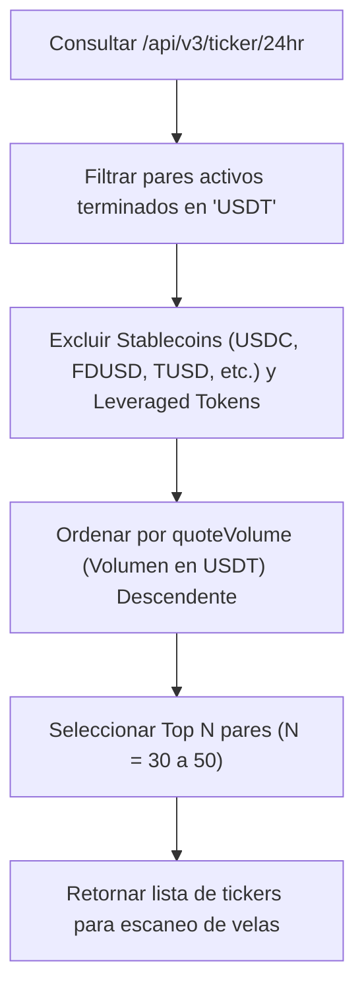

# SPEC-001: Capa de Ingesta y Adaptador de Mercado (Binance Read-Only)

**Documento:** Especificación Técnica de Ingesta de Datos  
**Código:** SPEC-001  
**Versión:** 1.0.0  
**Módulo:** Ingestion Layer  
**Estado:** Especificado  
**Última Actualización:** 2026-09-23  

---

## 1. Objetivo y Alcance

Definir los requerimientos técnicos y la implementación del conector de mercado para la Fase 1 (MVP), utilizando la API pública REST de **Binance Spot** en modo estricto de solo lectura (*read-only*), sin requerir firmas criptográficas ni credenciales privadas.

---

## 2. Endpoints y Estrategia de Ingesta

### 2.1 Base URL
- Producción: `https://api.binance.com`
- Alternativas de respaldo: `https://api1.binance.com`, `https://api2.binance.com`, `https://api3.binance.com`

### 2.2 Endpoints Utilizados

| Endpoint | Método | Peso (Weight) | Propósito |
| :--- | :--- | :--- | :--- |
| `/api/v3/ticker/24hr` | `GET` | 40 (todos los pares) o 2 (por símbolo) | Selección del universo de pares más líquidos contra USDT por volumen diario. |
| `/api/v3/klines` | `GET` | 2 por petición | Obtención de series temporales de velas OHLCV (`1h` y `4h`). |
| `/api/v3/ping` | `GET` | 1 | Healthcheck de conectividad y latencia. |

---

## 3. Algoritmo de Selección del Universo Líquido

Para evitar el escaneo indiscriminado de cientos de activos sin liquidez o pares ilíquidos:



### Reglas de Exclusión de Tickers:
- Excluir pares de stablecoin vs stablecoin: `USDCUSDT`, `FDUSDUSDT`, `TUSDUSDT`, `EURUSDT`.
- Excluir tokens apalancados (*UP/DOWN, BEAR/BULL*).
- Volumen mínimo de corte en 24h: $> \$10,000,000$ USD.

---

## 4. Recolección de Velas OHLCV (Klines)

Por cada símbolo seleccionado en el Top $N$:
- **Timeframe Primario:** `1h` (últimas 100 velas).
- **Timeframe Secundario (Contexto Estructural):** `4h` (últimas 50 velas).

### Estructura de Respuesta de Binance (`/api/v3/klines`):
```json
[
  [
    1499040000000,      // 0: Open time
    "0.01634790",       // 1: Open
    "0.80000000",       // 2: High
    "0.01575800",       // 3: Low
    "0.01577100",       // 4: Close
    "148976.11427815",  // 5: Volume
    1499644799999,      // 6: Close time
    "2434.19055334",    // 7: Quote asset volume
    308,                // 8: Number of trades
    ...
  ]
]
```

### Mapeo al Contrato Interno [`MarketCandle`](file:///E:/projects/gsolut/mvp-crypto-multi-tool/docs/02_architecture/SAD-002_data_contracts_and_schemas.md):
```python
candle = MarketCandle(
    timestamp=raw[0],
    open=float(raw[1]),
    high=float(raw[2]),
    low=float(raw[3]),
    close=float(raw[4]),
    volume=float(raw[5]),
    quote_volume=float(raw[7]),
    trades_count=int(raw[8])
)
```

---

## 5. Gestión de Rate Limits y Resiliencia

- **Límite de Binance:** 1200 a 6000 request weight por minuto (según IP).
- **Consumo Estimado por Corrida:**
  - 1 petición `/ticker/24hr`: peso 40.
  - 50 pares $\times$ 2 timeframes = 100 peticiones `/klines`: peso $100 \times 2 = 200$.
  - **Total por corrida:** $\approx 240$ puntos de peso (apenas el $4\%$ del límite de 6000).
- **Mecanismos de Protección:**
  - Lector de cabecera HTTP `x-mbx-used-weight-1m`. Si supera el 70% del límite, aplicar pausa de enfriamiento.
  - Reintentos con **Backoff Exponencial y Jitter** ante códigos `429` (Rate Limited) o errores transitorios de red `5xx`.
