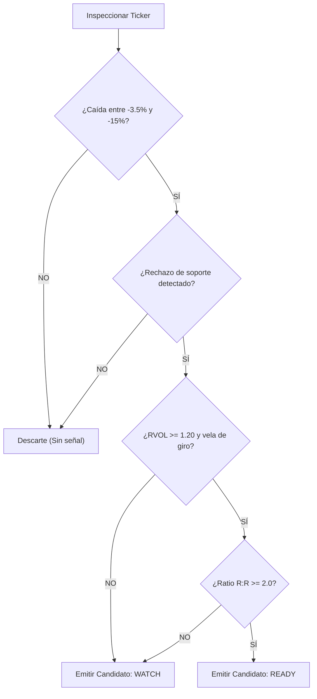

# SPEC-002: Motor de Análisis Técnico (Spot Opportunity Radar)

**Documento:** Especificación Técnica de Algoritmos y Estrategia  
**Código:** SPEC-002  
**Versión:** 1.0.0  
**Módulo:** Analysis Engine — Spot Radar  
**Estado:** Especificado  
**Última Actualización:** 2026-09-23  

---

## 1. Introducción y Objetivo

Esta especificación describe las fórmulas matemáticas, indicadores y reglas heurísticas deterministas que componen el algoritmo del **Spot Opportunity Radar**. El motor procesa series temporales [`MarketCandle`](file:///E:/projects/gsolut/mvp-crypto-multi-tool/docs/02_architecture/SAD-002_data_contracts_and_schemas.md) e identifica candidatos que satisfagan el setup **Dip & Bounce** (rebote táctico en activos líquidos).

---

## 2. Definición Matemática de Indicadores

### 2.1 Volumen Relativo (RVOL)
Mide la aceleración del volumen actual comparado con el promedio móvil de los periodos recientes:

$$\text{SMA\_Vol}_{k} = \frac{1}{K} \sum_{i=1}^{K} \text{Volumen}_{t-i} \quad (K = 20)$$

$$\text{RVOL}_{t} = \frac{\text{Volumen}_{t}}{\text{SMA\_Vol}_{k}}$$

- **Condición de Alerta:** $\text{RVOL} \ge 1.20$ (indica expansión de volumen de al menos $+20\%$ sobre su media).

---

### 2.2 Volatilidad Media (Average True Range - ATR)
Calcula el rango de movimiento real esperado para fijar márgenes de invalidación y targets acordes a la volatilidad del par:

$$\text{TR}_{t} = \max \Big( (\text{High}_{t} - \text{Low}_{t}), \, |\text{High}_{t} - \text{Close}_{t-1}|, \, |\text{Low}_{t} - \text{Close}_{t-1}| \Big)$$

$$\text{ATR}_{14} = \text{EMA}_{14}(\text{TR})$$

---

### 2.3 Medición de Contracción Porcentual ($\Delta P_{\text{drop}}$)
Se analiza la caída desde el precio máximo local dentro de una ventana de retroceso ($W = 36$ velas de 1h):

$$P_{\max} = \max_{i=0 \dots W} (\text{High}_{t-i})$$

$$\Delta P_{\text{drop}} = \frac{P_{t} - P_{\max}}{P_{\max}} \times 100$$

- **Criterio de Inclusión:** $-15.0\% \le \Delta P_{\text{drop}} \le -3.5\%$  
*(Caídas menores al $-3.5\%$ carecen de descuento táctico suficiente; caídas superiores al $-15\%$ en pocas horas suelen indicar eventos de liquidación desordenada o colapso fundamental).*

---

### 2.4 Detección Heurística de Absorción / Rechazo de Mínimos
Para verificar que el soporte está siendo defendido por compradores institucionales:

1. **Ratio de Mecha Inferior (Absorption Wick Ratio):**
   $$\text{Wick}_{\text{lower}} = \min(\text{Open}_{t}, \text{Close}_{t}) - \text{Low}_{t}$$
   $$\text{Range}_{\text{candle}} = \text{High}_{t} - \text{Low}_{t}$$
   $$\text{Ratio}_{\text{wick}} = \frac{\text{Wick}_{\text{lower}}}{\text{Range}_{\text{candle}}}$$
   - **Condición:** $\text{Ratio}_{\text{wick}} \ge 0.35$ en al menos una de las últimas 3 velas de 1h que tocaron el soporte.
2. **Desaceleración de la fuerza bajista:** El rango de las velas bajistas disminuye progresivamente en las últimas 3 velas previas al giro.

---

## 3. Lógica de Determinación de Niveles del Setup

Una vez calificada la anomalía, el algoritmo computa automáticamente los niveles operativos:

1. **Nivel de Invalidación ($P_{\text{inval}}$):**
   $$P_{\text{inval}} = \min_{i=0 \dots 12}(\text{Low}_{t-i}) - (0.25 \times \text{ATR}_{14})$$
   *(El mínimo de la estructura defensiva con un buffer de un cuarto de ATR para evitar barridas por ruido).*

2. **Rango de Entrada Sugerido ($P_{\text{entry\_min}} \dots P_{\text{entry\_max}}$):**
   - $P_{\text{entry\_min}} = P_{t} - (0.15 \times \text{ATR}_{14})$
   - $P_{\text{entry\_max}} = P_{t} + (0.10 \times \text{ATR}_{14})$

3. **Precio Objetivo Técnico ($P_{\text{target}}$):**
   Calculado al retroceso del $38.2\%$ de Fibonacci de la caída reciente o un múltiplo de $2.5 \times \text{ATR}$, con un piso mínimo de $+3.0\%$:
   $$P_{\text{target}} = \max\Big( P_{t} \times 1.035, \, P_{\max} - 0.618 \times (P_{\max} - P_{\text{inval}}) \Big)$$

4. **Ratio Beneficio / Riesgo ($R:R$):**
   $$\text{RR} = \frac{P_{\text{target}} - P_{t}}{P_{t} - P_{\text{inval}}}$$
   - **Umbral de Calificación:** Debe ser $\ge 2.0$.

---

## 4. Clasificación de Estados del Candidato

