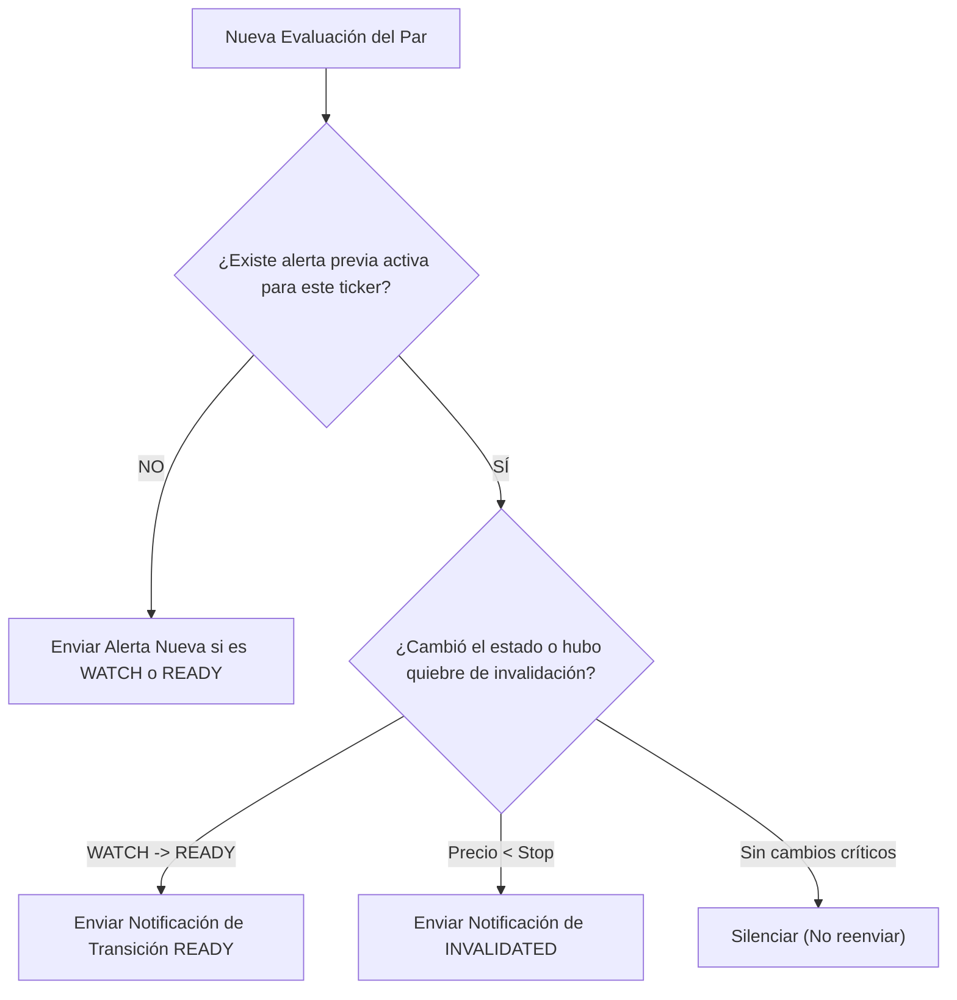

# SPEC-004: Capa de Despacho y Formateador de Alertas (CLI & Telegram)

**Documento:** Especificación Técnica de Alertas y Despacho  
**Código:** SPEC-004  
**Versión:** 1.0.0  
**Módulo:** Dispatch & Notification Layer  
**Estado:** Especificado  
**Última Actualización:** 2026-09-23  

---

## 1. Misión y Canales de Salida

La capa de despacho es responsable de traducir el objeto de datos [`AlertPayload`](file:///E:/projects/gsolut/mvp-crypto-multi-tool/docs/02_architecture/SAD-002_data_contracts_and_schemas.md) en mensajes legibles, sintéticos y de impacto inmediato para los operadores.

### Canales Implementados:
1. **Canal Telegram Bot:** Notificaciones push en tiempo real a chat o canal privado.
2. **Canal CLI / Consola:** Salida tabular e informativa con formato enriquecido para el operador local.
3. **Canal Event Log (JSONL):** Registro continuo en disco (`logs/alerts.jsonl`) para auditoría y métricas.

---

## 2. Estándar Visual de Mensaje (Telegram / Human Display)

Las alertas deben mantener una sintaxis limpia, estructurada y sin párrafos extensos:

```text
🚨 [TICKER] — [MODULO_ORIGEN]
────────────────────────────────────────
Precio Actual:     <Decimal>
Setup / Patrón:    <Nombre de Estrategia>
Rango de Entrada:  <Min> – <Max>
Objetivo Técnico:  <+X.X%> ≈ <Precio Objetivo>
Invalidación (SL): <Precio de Stop>
Volumen Relativo:  <Aumentando | Estable | Divergente> (RVOL X.XX)
Nivel de Riesgo:   <BAJO | MEDIO | ALTO>
Estado del Setup:  <WATCH | READY | INVALIDATED>
────────────────────────────────────────
Timestamp (UTC):   YYYY-MM-DD HH:mm:ss
Fuente de Datos:   Binance Spot REST

Diagnóstico Causal:
• <Condición 1: Comportamiento del precio y caída previa>
• <Condición 2: Sustento de volumen y soporte defendido>
• <Condición 3: Justificación del ratio beneficio/riesgo>
```

---

## 3. Ejemplo Concreto de Salida Formateada

```text
🚨 ALLO — SPOT RADAR
────────────────────────────────────────
Precio Actual:     0.2090 USDT
Setup / Patrón:    Rebote Táctico (Dip & Bounce)
Rango de Entrada:  0.2080 – 0.2100 USDT
Objetivo Técnico:  +5.0% ≈ 0.2195 USDT
Invalidación (SL): 0.2015 USDT
Volumen Relativo:  Aumentando (RVOL 1.38)
Nivel de Riesgo:   MEDIO
Estado del Setup:  READY
────────────────────────────────────────
Timestamp (UTC):   2026-09-23 04:15:00 UTC
Fuente de Datos:   Binance Spot REST

Diagnóstico Causal:
• Caída de -7.4% en 36h con preservación de soporte estructural en 0.2050
• Rechazo de mínimos en 1h con mecha del 45% y confirmación de RVOL > 1.2
• Ratio R:R proyectado de 2.4 con objetivo a primera resistencia local
```

---

## 4. Control de Anti-Spam y Transición de Estados

Para evitar saturar a los operadores con notificaciones redundantes en cada ciclo de escaneo:



### Reglas de Cooldown:
- Si un activo permanece en estado `WATCH`, solo se renotifica si pasaron más de 6 horas o si el precio varía más de un $1.5\%$ respecto al precio reportado originalmente.
- El paso de `WATCH` a `READY` tiene prioridad inmediata y se despacha sin demora.
