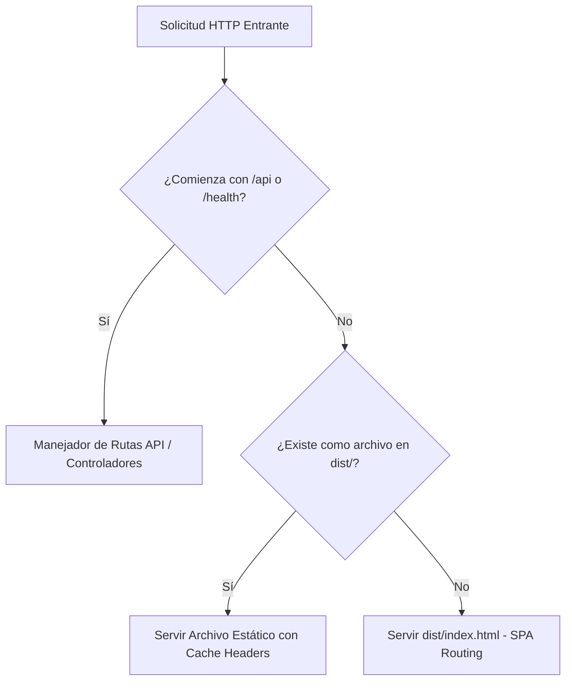

# Guía de Despliegue: Website Unificado Node.js en Hostinger

- **Plataforma:** Hostinger Web / Cloud Hosting (Node.js Application Manager)
- **Modelo de Despliegue:** Monoproceso Unificado (Frontend Estático + Backend API)
- **Runtime:** Node.js 20+ LTS
- **Comando de Inicio:** `npm start`
- **Destinatarios:** Germán & Andrés (gsolut)

---

## 1. Restricción y Contexto del Plan de Hosting

El plan contratado en Hostinger presenta la siguiente restricción técnica y operativa:

> [!IMPORTANT]
> **Regla de Despliegue en Hostinger:**
> - El entorno de hosting soporta **Node.js** pero no soporta demonios persistentes en Python (como FastAPI con Uvicorn).
> - Solo se justificaría usar dos websites independientes si se necesitasen ejecutar frontend y backend como procesos completamente separados, si el frontend fuese 100% estático en un plan separado, o si el backend utilizase Python.
> - Al contar con un backend en **Node.js**, la directiva arquitectónica es **desplegar frontend y backend en un único website Node.js**.

Para lograr este despliegue unificado en un solo website se deben cumplir 3 condiciones:
1. **Frontend Compilado:** El frontend SPA se compila a archivos estáticos (`dist/` o `build/`).
2. **Backend Multifunción:** El backend Node.js expone las rutas de API (`/api/*`, `/health`, etc.) y actúa como servidor de archivos estáticos para la SPA compilada.
3. **Inicio Único:** Todo el sistema se arranca mediante un único comando ejecutor: `npm start`.

---

## 2. Estructura de Archivos para Producción

La disposición del repositorio y los artefactos de distribución sigue la siguiente estructura:

```text
mvp-crypto-multi-tool/
├── web/                     # Código fuente Frontend (Vite + TypeScript)
│   ├── src/
│   ├── index.html
│   └── package.json
├── backend/                 # Código fuente Backend (TypeScript + Fastify/Express)
│   ├── src/
│   ├── tsconfig.json
│   └── package.json
├── dist/                    # Frontend compilado listo para ser servido
│   ├── index.html
│   └── assets/
│       ├── index-[hash].js
│       └── index-[hash].css
├── package.json             # Manifiesto raíz: orquestador de scripts y dependencias
├── server.js                # Entrypoint de producción registrado en Hostinger
└── .env                     # Variables de entorno de producción
```

---

## 3. Estrategia de Enrutamiento en el Servidor Node.js

El servidor Node.js orquesta el tráfico entrante según el orden de precedencia:



### Reglas de Prioridad:
1. **Prioridad 1 — Endpoints de API (`/api/*`, `/health`):**
   - Procesados directamente por el router del backend.
   - Retornan JSON, Server-Sent Events (SSE) o códigos de error HTTP estructurados.
2. **Prioridad 2 — Archivos Estáticos de la SPA (`/assets/*`, `favicon.ico`, etc.):**
   - Servidos desde la carpeta `dist/`.
   - Se configuran encabezados de caché inmutables (`Cache-Control: public, max-age=31536000, immutable`) para archivos con hash en el nombre.
3. **Prioridad 3 — Fallback SPA (Comodín `*`):**
   - Cualquier solicitud de navegación (e.g. `/radar`, `/settings`, `/diagnostics`) que no corresponda a un archivo físico ni a una API retorna `dist/index.html`.
   - Esto permite que el enrutador del cliente (HTML5 History API) maneje la navegación interna sin que Hostinger genere errores 404.

---

## 4. Orquestación y Scripts (`package.json`)

El archivo raíz `package.json` unifica el ciclo de vida del proyecto para el entorno de Hostinger:

```json
{
  "name": "crypto-multi-tool",
  "version": "0.1.0",
  "private": true,
  "scripts": {
    "build:web": "pnpm --filter web build",
    "build:backend": "pnpm --filter backend build",
    "build": "pnpm run build:web && pnpm run build:backend",
    "start": "node server.js"
  }
}
```

### Configuración en el Panel de Hostinger
- **Application Root:** `/` (o directorio de despliegue en `public_html`).
- **Application Startup File:** `server.js`.
- **Node.js Version:** 20.x o superior.
- **Environment Variables:**
  - `NODE_ENV=production`
  - `PORT=8000` (o el asignado dinámicamente por Hostinger `$PORT`)
  - `BINANCE_API_KEY`, `BINANCE_API_SECRET`
  - `TELEGRAM_BOT_TOKEN`, `TELEGRAM_CHAT_ID`

---

## 5. Ventajas Operativas Clave

1. **Cero Problemas de CORS:**
   Al servirse la SPA y la API desde el mismo dominio y puerto (`https://tudominio.com` y `https://tudominio.com/api`), no existen bloqueos por políticas de origen cruzado ni latencia añadida por peticiones HTTP `OPTIONS` pre-flight.
2. **Ahorro de Recursos en Hosting:**
   Utiliza un único slot/website del plan de Hostinger, reduciendo costos y evitando dispersión de configuraciones DNS o certificados SSL.
3. **Despliegue Atómico:**
   Todo el sistema se empaqueta o se sincroniza como una unidad indivisible, evitando desfasajes de versión entre el cliente web y el backend.
