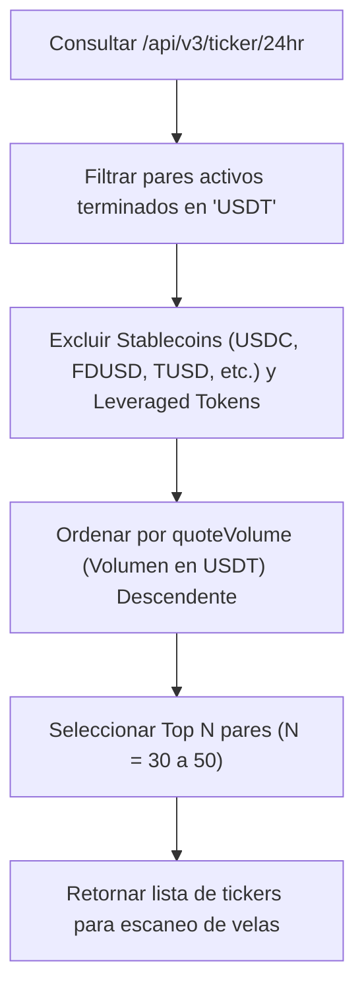

# Especificación Técnica: Capa de Ingesta y Adaptador de Mercado (Binance Read-Only)

- **Módulo:** Ingestion Layer / Exchange Adapter
- **Fase:** Fase 1 (MVP)
- **Estado:** Especificado y Aprobado
- **Última Actualización:** 2026-09-23

---

## 1. Objetivo y Alcance

Definir los requerimientos técnicos y la implementación del conector de mercado para la Fase 1 (MVP), utilizando la API pública REST de **Binance Spot** en modo estricto de solo lectura (*read-only*), sin requerir firmas criptográficas ni credenciales privadas.

---

## 2. Endpoints y Estrategia de Ingesta

### 2.1 Base URL
- Producción: `https://api.binance.com`
- Alternativas de respaldo: `https://api1.binance.com`, `https://api2.binance.com`, `https://api3.binance.com`

### 2.2 Endpoints Utilizados

| Endpoint | Método | Peso (Weight) | Propósito |
| :--- | :--- | :--- | :--- |
| `/api/v3/ticker/24hr` | `GET` | 40 (todos los pares) o 2 (por símbolo) | Selección del universo de pares más líquidos contra USDT por volumen diario. |
| `/api/v3/klines` | `GET` | 2 por petición | Obtención de series temporales de velas OHLCV (`1h` y `4h`). |
| `/api/v3/ping` | `GET` | 1 | Healthcheck de conectividad y latencia. |

---

## 3. Algoritmo de Selección del Universo Líquido

Para evitar el escaneo indiscriminado de cientos de activos sin liquidez o pares ilíquidos:



### Reglas de Exclusión de Tickers:
- Excluir pares de stablecoin vs stablecoin: `USDCUSDT`, `FDUSDUSDT`, `TUSDUSDT`, `EURUSDT`.
- Excluir tokens apalancados (*UP/DOWN, BEAR/BULL*).
- Volumen mínimo de corte en 24h: $> \$10,000,000$ USD.

---

## 4. Gestión de Concurrencia y Rate Limiting

Binance asigna un límite de peso de **1200 request weight por minuto** para peticiones IP no autenticadas.

### 4.1 Estrategia de Consumo de Peso
- Llamada a `/ticker/24hr`: 40 weight (ejecutada cada 5 a 15 minutos).
- Carga de velas para 40 pares: $40 \text{ pares} \times 2 \text{ weight} = 80 \text{ weight}$.
- **Consumo total por barrida:** $\sim 120$ weight (apenas un 10% del límite por minuto permitido).

### 4.2 Control y Backoff
- Leer la cabecera HTTP `x-mbx-used-weight-1m` en cada respuesta.
- Si el peso utilizado supera 800, pausar peticiones automáticas durante 5 segundos.
- Si se recibe un código HTTP `429` (Too Many Requests), detener peticiones de inmediato y esperar el valor indicado en la cabecera `Retry-After`.

---

## 5. Normalización y Validación de Datos

Los datos brutos recibidos de Binance (arrays de strings) son validados y transformados a la estructura canónica [`MarketCandle`](file:///e:/projects/gsolut/mvp-crypto-multi-tool/docs/architecture/data-contracts.md):

```text
Binance Raw Array:
[
  1499040000000,      // Open time
  "0.01634790",       // Open
  "0.80000000",       // High
  "0.01575800",       // Low
  "0.01577100",       // Close
  "148976.11427815",  // Volume (Base)
  1499644799999,      // Close time
  "2434.19055334",    // Quote asset volume (USDT)
  308,                // Number of trades
  ...
]
```

### Reglas de Validación:
1. `High >= Low`, `High >= Open`, `High >= Close`.
2. `Volume >= 0` y `QuoteVolume >= 0`.
3. Timestamps correlativos sin saltos temporales superiores al timeframe solicitado ($> 1h$).
4. Si la última vela no está cerrada (`is_closed == false`), se procesa como vela en formación sin alterar métricas de cierre definitivas.
